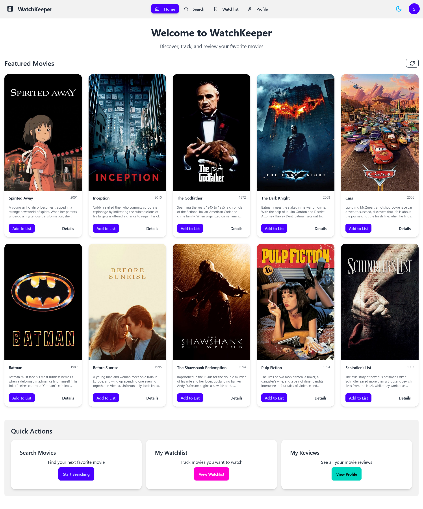
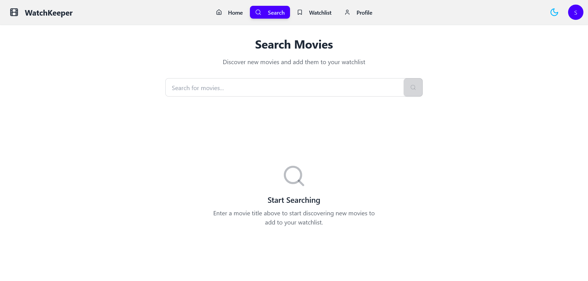
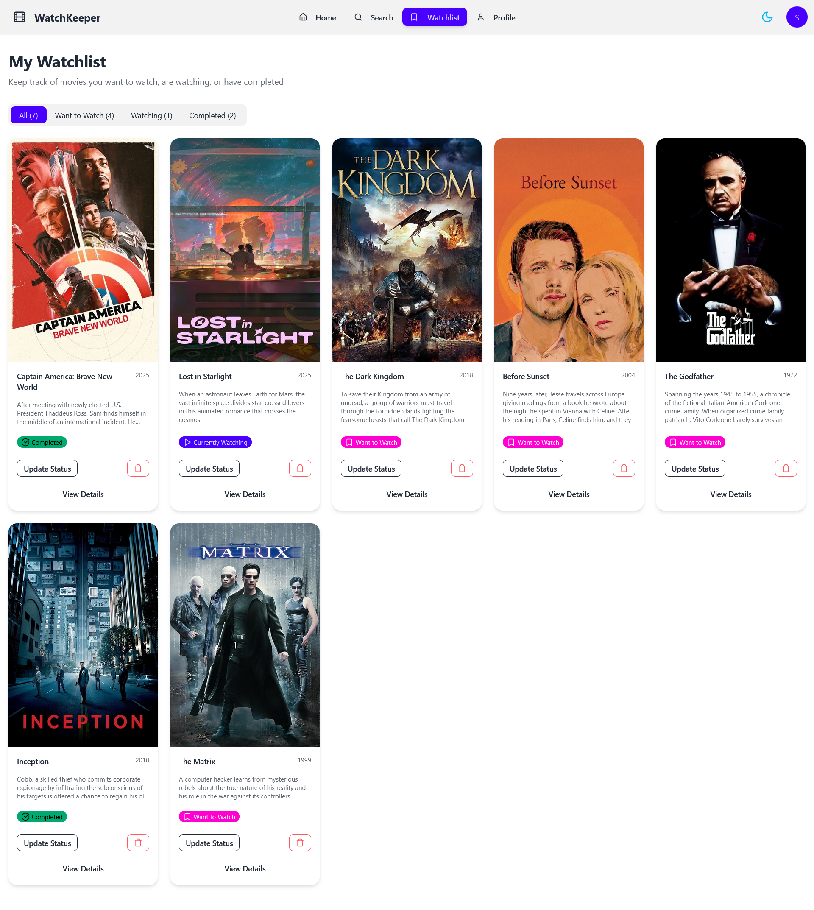
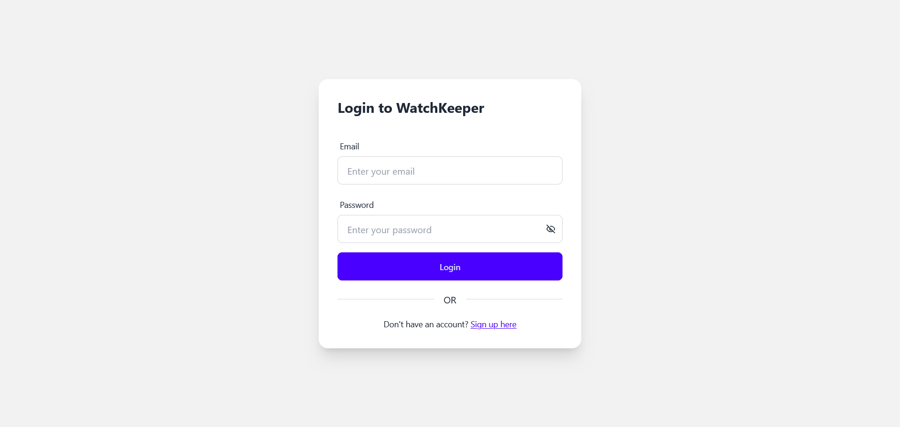
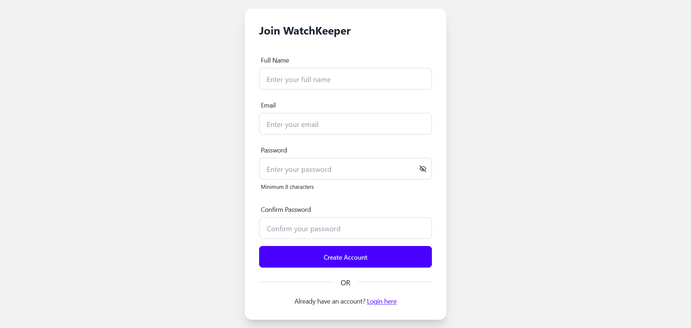

# WatchKeeper 🎬

A full-stack Movie Watchlist app where users can search movies, manage their watchlist, and write reviews. Built with **React**, **Node.js**, and **PostgreSQL**.

🔗 [Live Demo on Render](https://watchkeeper.onrender.com)

---

## ✨ Features

✅ Search movies via TMDB  
✅ Add movies to your watchlist  
✅ Track status: Want to Watch, Watching, Completed  
✅ Write and edit reviews  
✅ View other users' reviews  
✅ Auth (register & login)  
✅ Responsive and modern UI

---

## 🛠 Tech Stack

- **Frontend:** React + Vite, Tailwind CSS, React Router
- **Backend:** Node.js, Express.js
- **Database:** PostgreSQL
- **API:** The Movie Database (TMDB)
- **State Management:** Zustand
- **Other Libraries:** Axios, React Hot Toast, Lucide Icons

---

## 🖥️ Local Setup

### 1. Clone the Repo

```bash
git clone https://github.com/saciinol/watchkeeper.git
cd watchkeeper
```
### 2. Install Dependencies

```npm run build```

### 3. Create Environment Files

- **PORT** – Port number your backend server should run on (e.g. 5000)
- **JWT_SECRET** – Secret key for JWT token signing
- **JWT_EXPIRES_IN** – JWT token expiration (e.g. 1d, 7d)
- **PGUSER** – Postgres user name
- **PGPASSWORD** – Postgres password
- **PGHOST** – Database host (e.g. localhost, or a cloud DB host)
- **PGDATABASE** – Database name (default: watchkeeper)
- **TMDB_API_KEY** – Your TMDB API key
- **NODE_ENV** – Either `development` or `production`

### 4. Run the App

```npm run dev
cd frontend
npm run dev
```

---

## 🗄️ Database

Uses PostgreSQL.
See backend/seeds for example movie seed data.

---

## 📸 Screenshots

### Home Page



### Search Page



### Watchlist Page



### Profile Page


### Login Page



### Register Page



---

## 🎬 Credits

This product uses the TMDB API but is not endorsed or certified by TMDB.

---

## 🤝 Contributing

Contributions are welcome! Please open an issue or submit a pull request.

---

## License

Distributed under the MIT License.

---

## 📫 Contact

Darren Nicolas - [darrenicolas18@gmail.com](mailto:darrenicolas18@gmail.com)
